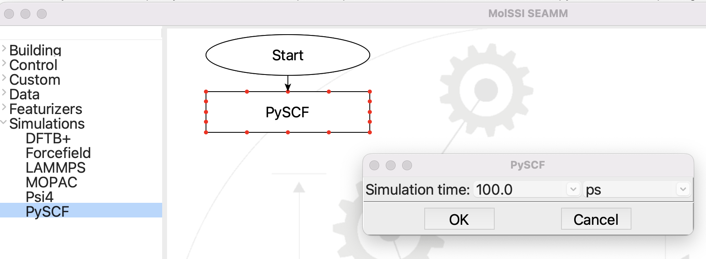

***********************
"Compiling" the plug-in
***********************

We'll get to looking at the code in a minute, but first let's try "compiling" the
plug-in -- yes, it is Python, so not compiled, but the cookiecutter provides tools for
checking the Python to make sure it compliant with PEP-8, installing the package, and
then testing the module. There is a Makefile at the top level of the directory that was
just created so you don't have to remember the details of the commands. You need to `cd`
to the directory and run `make lint install test`::

  (seamm-dev) psaxe@PaulsPersonal SEAMM % cd pyscf_step
  cd pyscf_step
  (seamm-dev) psaxe@PaulsPersonal pyscf_step % make lint install test
  make lint install test
  black --extend-exclude '_version.py' --check --diff pyscf_step tests
  --- pyscf_step/pyscf_parameters.py	2022-08-23 14:11:02.511277 +0000
  +++ pyscf_step/pyscf_parameters.py	2022-08-23 15:28:00.288841 +0000
  @@ -107,8 +107,6 @@
	   None
	   """

	   logger.debug("PySCFParameters.__init__")

  -        super().__init__(
  -            defaults={**PySCFParameters.parameters, **defaults}, data=data
  -        )
  +        super().__init__(defaults={**PySCFParameters.parameters, **defaults}, data=data)
  would reformat pyscf_step/pyscf_parameters.py
  --- pyscf_step/pyscf.py	2022-08-23 14:11:02.491172 +0000
  +++ pyscf_step/pyscf.py	2022-08-23 15:28:00.333578 +0000
  @@ -48,17 +48,11 @@
       --------
       TkPySCF,
       PySCF, PySCFParameters
       """

  -    def __init__(
  -        self,
  -        flowchart=None,
  -        title="PySCF",
  -        extension=None,
  -        logger=logger
  -    ):
  +    def __init__(self, flowchart=None, title="PySCF", extension=None, logger=logger):
	   """A step for PySCF in a SEAMM flowchart.

	   You may wish to change the title above, which is the string displayed
	   in the box representing the step in the flowchart.

  would reformat pyscf_step/pyscf.py

  Oh no! 💥 💔 💥
  2 files would be reformatted, 5 files would be left unchanged.
  make: *** [lint] Error 1

**black** is complaining about some of the formatting. The cookiecutter prepares
reasonably formatted code, but since it doesn't know how long the name of the package
and classes, it may not get it right. "PySCF" is quite short, so a couple of the
arguments for methods could be written on one line, rather than several, and black,
being picky wants you to change the code. Of course there is a make target to do this!
`make format`::

  (seamm-dev) psaxe@PaulsPersonal pyscf_step % make format
  make format
  black --extend-exclude '_version.py' pyscf_step tests
  reformatted pyscf_step/pyscf_parameters.py
  reformatted pyscf_step/pyscf.py

  All done! ✨ 🍰 ✨
  2 files reformatted, 5 files left unchanged.

.. attention::
   You may not be in the habit of using **black** and **flake8**, but we strongly
   recommend that you use the Makefile in SEAMM projects and use `make lint install
   test` religously as you develop. At first you may have a lot of format issues, but
   will quickly learn (be trained?) to write clean code in the style used in all SEAMM
   modules. In a large project such as SEAMM it is important that the code be similar
   throughout. We have set up the environment for **black** and **flake8** to ensure
   consistency and a standard style for SEAMM. So please use the Makefile!

Now that the code is properly formatted, we can run `make lint install test` again::

  (seamm-dev) psaxe@PaulsPersonal pyscf_step % make lint install test
  make lint install test
  black --extend-exclude '_version.py' --check --diff pyscf_step tests
  All done! ✨ 🍰 ✨
  7 files would be left unchanged.
  flake8 pyscf_step tests
  rm -fr build/
  rm -fr dist/
  rm -fr .eggs/
  find . -name '*.egg-info' -exec rm -fr {} +
  find . -name '*.egg' -exec rm -f {} +
  find . -name '*.pyc' -exec rm -f {} +
  find . -name '*.pyo' -exec rm -f {} +
  find . -name '*~' -exec rm -f {} +
  find . -name '__pycache__' -exec rm -fr {} +
  rm -fr .tox/
  rm -f .coverage
  rm -fr htmlcov/
  find . -name '.pytype' -exec rm -fr {} +
  pip uninstall --yes pyscf_step
  Found existing installation: pyscf-step 2022.8.19+0.gb0ce607.dirty
  Uninstalling pyscf-step-2022.8.19+0.gb0ce607.dirty:
    Successfully uninstalled pyscf-step-2022.8.19+0.gb0ce607.dirty
  pip install .
  Processing /Users/psaxe/Work/SEAMM/pyscf_step
    Preparing metadata (setup.py) ... done
  Requirement already satisfied: seamm in /Users/psaxe/opt/miniconda3/envs/seamm-dev/lib/python3.9/site-packages (from pyscf-step==2022.8.23+0.g408f84e.dirty) (2022.7.25)

  ...

  Building wheels for collected packages: pyscf-step
    Building wheel for pyscf-step (setup.py) ... done
    Created wheel for pyscf-step: filename=pyscf_step-2022.8.23+0.g408f84e.dirty-py2.py3-none-any.whl size=12893 sha256=cbf0b6ecac5a3430f503732172cc13c3545f8c97ffa5b1fe6b1ff96444dd994f
    Stored in directory: /private/var/folders/yx/lvx13lsj5fq9z03v89r78jpm0000gp/T/pip-ephem-wheel-cache-d2_nitkf/wheels/81/48/ca/4dcb65ac8de14c102779dc76584d4b416d2962d381d224c8b6
  Successfully built pyscf-step
  Installing collected packages: pyscf-step
  Successfully installed pyscf-step-2022.8.23+0.g408f84e.dirty
  pytest tests/
  ============================================================================== test session starts =====================================================
  platform darwin -- Python 3.9.13, pytest-7.1.2, pluggy-1.0.0
  rootdir: /Users/psaxe/Work/SEAMM/pyscf_step
  plugins: cov-3.0.0
  collected 1 item
  tests/test_pyscf_step.py .                                                                                                                     [100%]

  =============================================================================== 1 passed in 3.55s ======================================================
  (seamm-dev) psaxe@PaulsPersonal pyscf_step %

That worked! It installed and tested your new skeleton plug-in. Later you will have a
chance to look at the tests, and add to the one very simple test that was created
automatically, but for now ... success!

So, what just happened? Let's start SEAMM and find out.

   
   The initial PySCF plug-in in SEAMM

PySCF appears under the simulations in the left pane, clicking on adds a PySCF step to
the flowchart, and double-clicking on the step opens a dialog for editing the options
for the step. In otherwords, we have a complete, functioning plug-in but of course it
doesn't know anything about PySCF. That's your job now: educate the plug-in about PySCF.
