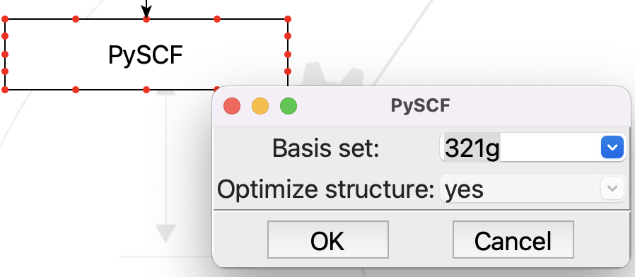

***********************
Create a test flowchart
***********************

Now we are ready to test the new plug-in. All we need is a structure, so start with a
**From SMILES** step, followed by the new **PySCF** step:

.. figure:: images/test_flowchart.png
   :align: center
   :alt: The flowchart for testing the **PySCF** step
   
   The flowchart for testing the **PySCF** step

.. note::
   You may download the flowchart :download:`here. <../../../_static/seamm/simple_plugin/pyscf.flow>`

Open the **From SMILES** step and put in the SMILES for water, which is just "O":

.. figure:: images/smiles.png
   :align: center
   :alt: Editing the **From SMILES** step
   
   Editing the **From SMILES** step

And the new **PySCF** step:

   
   Editing the **PySCF** step

This looks just like we expect. You can change the basis set by pulling down the menu on
the combobox, or you can type in any basis set name that PySCF recognizes.

Running the flowchart
---------------------
There are two ways to run the flowchart, either using the DashBoard or on the
command-line. Pick the way that works for you.

Using the DashBoard
~~~~~~~~~~~~~~~~~~~

If you setup a Dashboard for the development
environment, you can submit to it. There are a couple tutorials about setting up and
using the Dashboard in the `main tutorials <../../../tutorials/index>`_. Note that the
development Dashboard uses port 55066, not 55055, by default. The first time that you
try to run on the development Dashboard you will need to let SEAMM know where it
is. Click on the **Add dashboard...** button, give the dashboard a name like "dev" or
"development" so you recognize it in the future, and use https://localhost:55066

Once the job is submitted, point you browser at the Dashboard and look at the job. If
you click on `job.out` and scroll down you should see something like this:

.. figure:: images/job_out.png
   :align: center
   :alt: The output from running PySCF on water
   
   The output from running PySCF on water

From the command-line
~~~~~~~~~~~~~~~~~~~~~

You need to save the flowchart in a place that you remember. Use **File/Save** or
**ctrl-S**. Now open up a command or terminal window, make sure to activate the
seamm-dev conda environment, and go to some empty, temporary directory.

Now execute the flowchart. In the example below I saved the flowchart as
~/Downloads/pyscf.flow::

  (seamm-dev) psaxe@PaulsPersonal tmp % pwd
  pwd
  /Users/psaxe/tmp
  (seamm-dev) psaxe@PaulsPersonal tmp % ls -l
  ls -l
  total 0
  (seamm-dev) psaxe@PaulsPersonal tmp % ~/Downloads/pyscf.flow 
  ~/Downloads/pyscf.flow 

  Running in standalone mode.
  Running in directory '/Users/psaxe/tmp'

  Description of the flowchart
  ----------------------------
  Step 0: Start  2022.7.25

  Step 1: from SMILES  2021.10.13
      Create the structure from the SMILES 'O', overwriting the current
      configuration. The name of the system will be the canonical SMILES of the
      structure. The name of the configuration will be initial.

  Step 2: PySCF  2022.8.23+0.g408f84e.dirty
      Please replace this with a short summary of the PySCF step, including key
      parameters.

  Running the flowchart
  ---------------------
  Step 0: Start  2022.7.25

  Step 1: from SMILES  2021.10.13
      Create the structure from the SMILES 'O', overwriting the current
      configuration. The name of the system will be the canonical SMILES of the
      structure. The name of the configuration will be initial.

      Created a molecular structure with 3 atoms.
	     System name = O
      Configuration name = initial

  Step 2: PySCF  2022.8.23+0.g408f84e.dirty
      Please replace this with a short summary of the PySCF step, including key
      parameters.

  output file: /Users/psaxe/tmp/2/PySCF.out
  INFO:pyscf.geomopt.berny_solver.6128794208:0 Internal coordinates:
  INFO:pyscf.geomopt.berny_solver.6128794208:0 * Number of fragments: 1
  INFO:pyscf.geomopt.berny_solver.6128794208:0 * Number of internal coordinates: 3
  INFO:pyscf.geomopt.berny_solver.6128794208:0 * Number of strong bonds: 2
  INFO:pyscf.geomopt.berny_solver.6128794208:0 * Number of strong angles: 1
  INFO:pyscf.geomopt.berny_solver.6128794208:1 Energy: -75.5837470866
  ...
  INFO:pyscf.geomopt.berny_solver.6128794208:4 * Step maximum: 5.82e-05 < 0.0018 => OK
  INFO:pyscf.geomopt.berny_solver.6128794208:4 * All criteria matched

      The molecule has C2v symmetry, the calculation will use C2v symmetry.

      With the 321g basis set, the optimization converged in 4 steps to an energy
      of -75.585960 E_h

  Wrote the final structure to 'final_structure.mmcif' for viewing.

  Primary references:

  (1) Jessica Nash and Eliseo Marin-Rimoldi and Mohammad Mostafanejad and Paul
      Saxe. SEAMM: Simulation Environment for Atomistic and Molecular Modeling,
      version 2022.7.25; The Molecular Sciences Software Institute (MolSSI):
      Virginia Tech, Blacksburg, VA, USA, https://doi.org/10.5281/zenodo.5153984,
      DOI: 10.5281/zenodo.5153984

  (2) O'Boyle, Noel M. and Banck, Michael and James, Craig A. and Morley, Chris
      and Vandermeersch, Tim and Hutchison, Geoffrey R. Open Babel: An open
      chemical toolbox. Journal of Cheminformatics 2011, 3, 33. DOI:
      10.1186/1758-2946-3-33

  (3)  The Open Babel Package, version 3.1.0; Open Babel, http://openbabel.org

  Secondary references:

  (1) Paul Saxe. From Smiles plug-in for SEAMM for creating structures from
      SMILES, version 2021.10.13; The Molecular Sciences Software Institute
      (MolSSI): Virginia Tech, Blacksburg, VA, USA, https://github.com/molssi-
      seamm/from_smiles_step, DOI: 10.5281/zenodo.5159800

  (2) Paul Saxe. Pyscf plug-in for SEAMM, version 2022.8.23+0.g408f84e.dirty;
      paulsaxe: USA, https://github.com/paulsaxe/pyscf_step

  Process time: 0:00:13.923655 (13.924 s)
  Elapsed time: 0:00:02.423875 (2.424 s)
  (seamm-dev) psaxe@PaulsPersonal tmp % 

PySCF prints INFO lines for every iteration of the optimization to the stdout, so when
you run from the command line you will see them. I removed most from the output above to
keep it short and readable.

Part way through the output you will the output from PySCF telling you the number of
iterations and the energy. Success! Also note the last reference::

  (2) Paul Saxe. Pyscf plug-in for SEAMM, version 2022.8.23+0.g408f84e.dirty;
      paulsaxe: USA, https://github.com/paulsaxe/pyscf_step

This is the reference for the plug-in that the cookiecutter made for you. Of course,
yours will be different, having your name and GitHub project.

Conclusion
----------

Congratulations! If you made it here you have created a plug-in for PySCF and run a
simple calculation.

