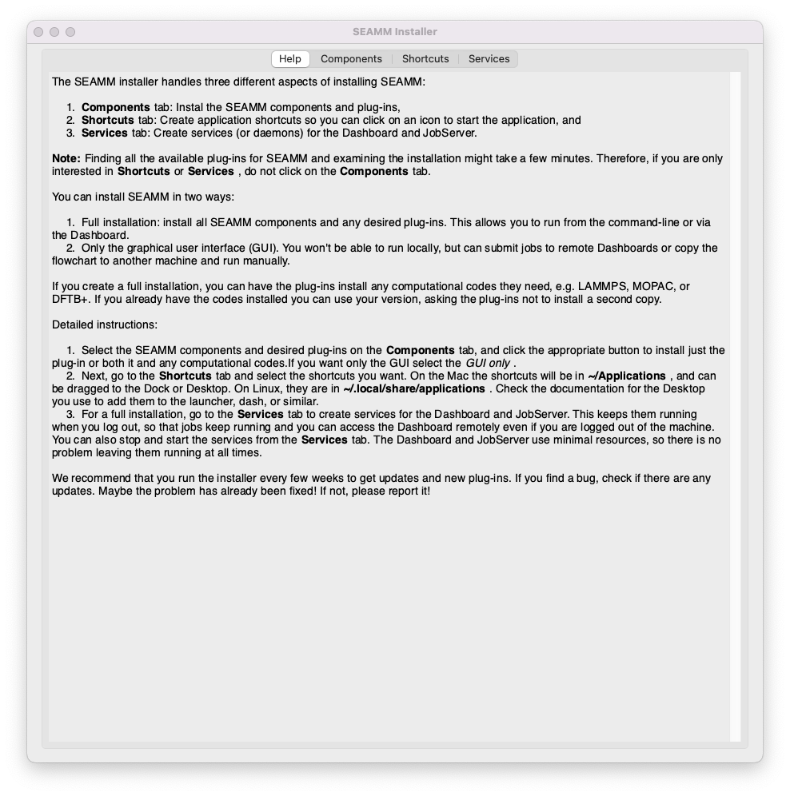

.. _`graphical installation`:

**********************
Graphical Installation
**********************

.. note::
   A `video of installing SEAMM <https://www.youtube.com/watch?v=gqWzTvgPM1I>`_ is
   available in the `SEAMM YouTube channel`_. Please note that this video is slightly
   out of date and there might be small differences between what you read here and 
   watch there.

SEAMM should be installed in the **seamm** conda environment. Open a terminal 
and run the following commands::

  conda create -n seamm -c conda-forge seamm seamm-installer seamm-dashboard python=3.9

If you do not intend to run the SEAMM Dashboard in this installation, you can leave it
off the command line::

  conda create -n seamm -c conda-forge seamm seamm-installer python=3.9

Once the environment is in place, you can activate it as prompted::

  conda activate seamm

You can choose a different name for your SEAMM environment by replacing
the ``<name>`` argument in the ``-n <name>`` option with your preferred title.

Now run the SEAMM Installer to install both the SEAMM environment and the available
plug-ins::

  seamm-installer

You will see a window like this:

   
   The initial window of the Installer

Click on the second tab **Components**. The Installer needs to examine the installation
and sometimes -- like this first time you use it -- needs to search the Internet to find
the plug-ins for SEAMM. This can take a few minutes, so be patient! A small dialog will
come up in front of the Installer to let you know about progress. When the Installer has
examined everthing it will fill out the window, like this:

.. figure:: images/components.png
   :align: center
   :alt: The initial Components tab.
   
   The initial Components tab.

The lines in green show components or plug-ins that are installed and up-to-date. Black
indicates that the item is not installed, and red indicates items that are installed but
out-of-date. The first time that you run the Installer most of the core packages will be
installed and up-to-date because you just installed them as you created the Conda
environment.

You can select the plug-ins that you want, or select everything using the ``Select all``
button. Once you are happy with your selection, click the ``Install selected``
button. Don't worry if you have selected some of the packages that are already
installed: they will be ignored.  Depending on your internet connection, computer, and
the plug-ins selected, the installation can take up to 10 or 20 minutes.  This is
because many of the plug-ins also install additional software such as LAMMPS, Psi4,
Packmol, and DFTB+, and some of these packages are quite large and take time to install.

When the installation is done, the window will update with the current status. If you
wish you can select more packages to install and repeat the process.

.. note::
   If you plan to only use the GUI on this machine, and submit jobs to other machines,
   you can select the **GUI only** checkbox. This will install only the components for
   the GUI of SEAMM. Neither the Dashboard or JobServer will be installed, nor will any
   of the background software, like LAMMPS, be installed. This is both faster and keeps
   the installation smaller.

Once you are happy with the installation, go to the next tab, **Shortcuts** to install
shortcuts for starting SEAMM and the Installer. It looks like this:

.. figure:: images/shortcuts.png
   :align: center
   :alt: The initial Shortcuts tab.
   
   The initial Shortcuts tab.

Select the applications that you want, and click ``Create selected apps`` to create the
shortcuts. On a Mac, the shortcuts will be in ``~/Applications``, i.e. the Applications folder
under your home directory, not the main ``/Applications`` folder. On Linux, they will be
in ``~/.local/share/Applications``. You can usually drag the shortcuts to the desktop,
dock, launcher or similar place for easy access; however, the details depend on the your
OS and desktop so check the documentation if need be.

Finally, go to the last tab, **Services**, to install the Dashboard and JobServer as
services so that they are always available. This tab looks like this:

.. figure:: images/services.png
   :align: center
   :alt: The initial Services tab.
   
   The initial Services tab.

If you want to run jobs locally, select both the Dashboard and JobServer and click on
``Create selected services``. This will install the services and start them. Note the
other two buttons, which let you stop and start the services if you need.

.. Link shortcuts and cross-referencing labels
.. _Miniconda: https://docs.conda.io/en/latest/miniconda.html
.. _Anaconda: https://www.anaconda.com/distribution
.. _SEAMM YouTube channel: https://www.youtube.com/channel/UCF_5Kr_AN90CYb0fTgYQHzQ
