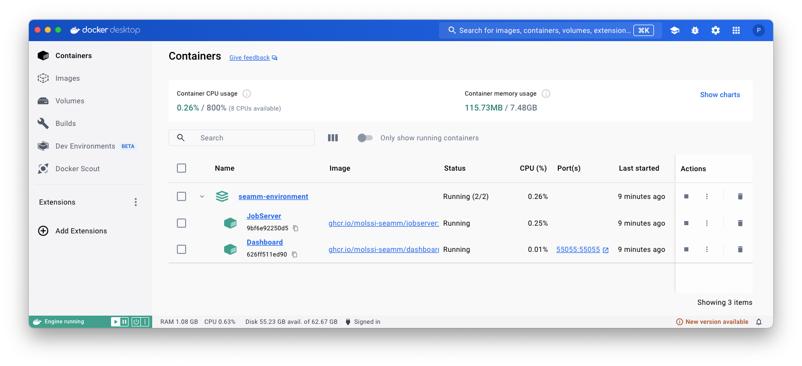

.. _seamm-environment:

Starting the SEAMM environment & Dashboard
==========================================

.. Attention::
   The docker images are large (~ 1 GB), and may take some time to download. The first
   time you run a part of SEAMM, it will take some time to start up, as the image is
   downloaded and unpacked. Subsequent starts will be faster both because the images are
   cached on disk and because the various images for SEAMM share a common base image.

MacOS
-----
If you are using MacOS you can install an application to create and start the Dashboard
and JobServer. Download :download:`Dashboard.zip <./Dashboard.zip>` and unzip it in your
personal Applications folder -- the one insde your home directory. You can do this in
Finder by dragging the file to the Applications directory under your home folder. Then
double-click on Dashboard.zip to expand it, creating Dashboard.app. You can then double-click on
Dashboard.app to start the SEAMM environment. You can also drag Dashboard.app to your dock to make
it easier to start in the future. 

Running this multiple times will do nothing if the Dashboard and JobServer are already
running. If the are stopped, it will start them.

Linux
-----
You can make an alias in your shell to start the SEAMM GUI. Add the following line to
your `~/.bashrc` file::

  alias Dashboard='docker compose --file seamm-environment.yaml up -d'

You can then start the Dashboard and Jobserver by typing *Dashboard* in a terminal window.

Windows
-------
You can make a shortcut to start the Dashboard and JobServer. Right-click on the desktop and select
"New" and then "Shortcut". In the dialog box that appears, enter the following command::

  C:\Windows\System32\wsl.exe -d docker-desktop -u root -- docker compose --file seamm-environment.yaml up -d

You can then double-click on the shortcut to start the Dashboard and Jobserver.

.. Warning::
   We have not yet installed on SEAMM on Windows using Docker. We are working on this!
   Hopefully the above instruction will work, but we have not tested it yet.

General
-------
.. Important::
   The directory ~/SEAMM needs to exist! If it doesn't, please create it!

Once you have *Docker* installer, you can start the SEAMM environment by running the
following command in the terminal::

  docker compose --file seamm-environment.yaml up -d

where the file `seamm-environment.yaml` is like this::

  version: "3.8"
  name: seamm-environment
  services:
    dashboard:
      container_name: Dashboard
      image: ghcr.io/molssi-seamm/dashboard:latest
      command: --dashboard-name "SEAMM (Docker)"
      restart: unless-stopped
      ports:
	- '55055:55055'
      networks:
	- seamm-network
      volumes:
	- type: bind
	  source: ~/SEAMM
	  target: /root/SEAMM

      # flask requires SIGINT to stop gracefully
      # (default stop signal from Compose is SIGTERM)
      stop_signal: SIGINT

    jobserver:
      container_name: JobServer
      image: ghcr.io/molssi-seamm/jobserver:latest
      command: JobServer --no-windows
      restart: unless-stopped
      # environment:
      #   - DISPLAY=host.docker.internal:0
      volumes:
	- type: bind
	  source: ~/SEAMM
	  target: /root/SEAMM
	- type: bind
	  source: /var/run/docker.sock
	  target: /var/run/docker.sock

  networks:
    seamm-network:
      driver: bridge
      name: seamm-network

You should see output like this::

  psaxe@h80adf301 tmp % docker compose --file seamm-environment.yaml up -d  
  [+] Running 2/4
   ⠸ Network seamm-network              Created          0.4s 
   ⠸ Network seamm-environment_default  Created          0.3s 
   ✔ Container Dashboard                Started          0.3s 
   ✔ Container JobServer                Started          0.2s 
  psaxe@h80adf301 tmp % 
  
The Dashboard and JobServer should now be running. You can check the Dashboard at
http://localhost:55055, and also can use the Docker Desktop window to see their status:

