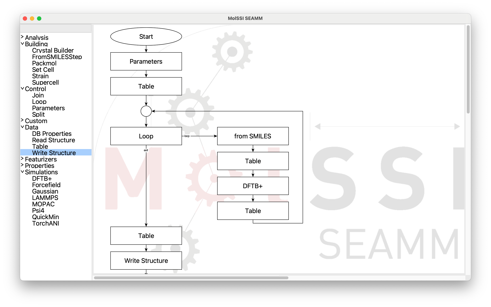
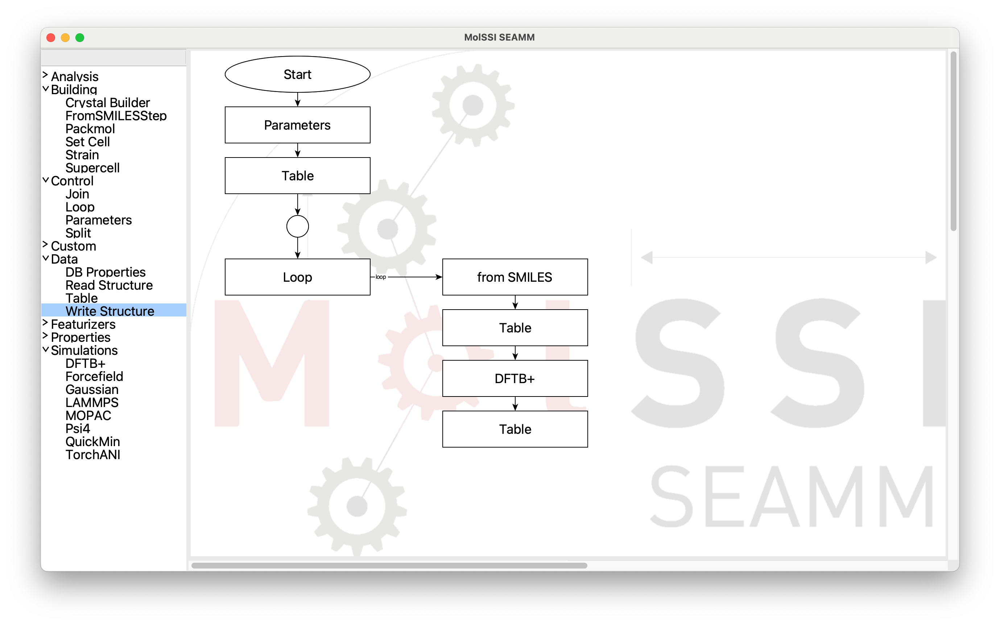
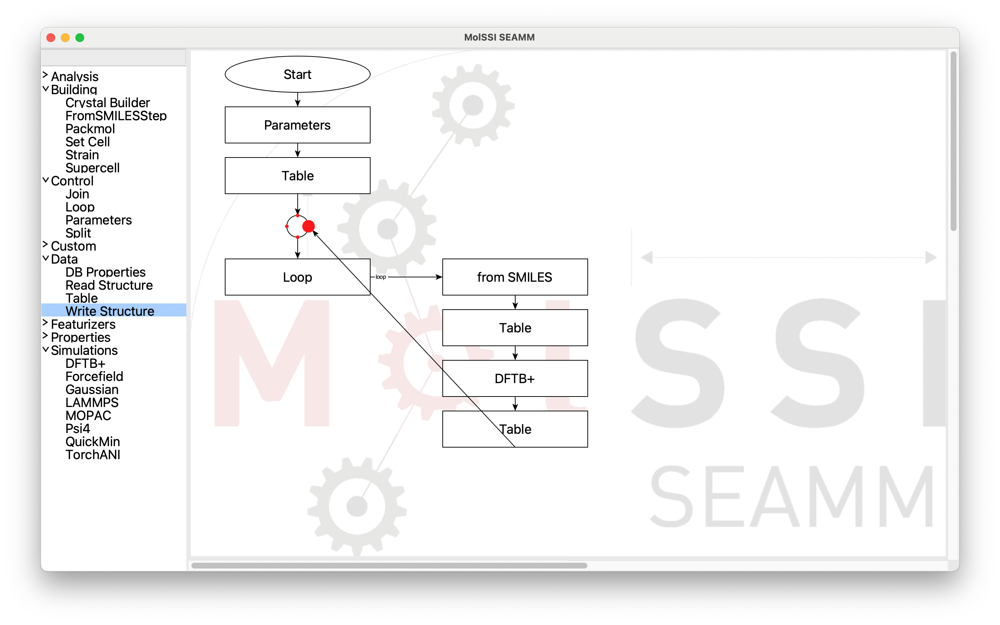
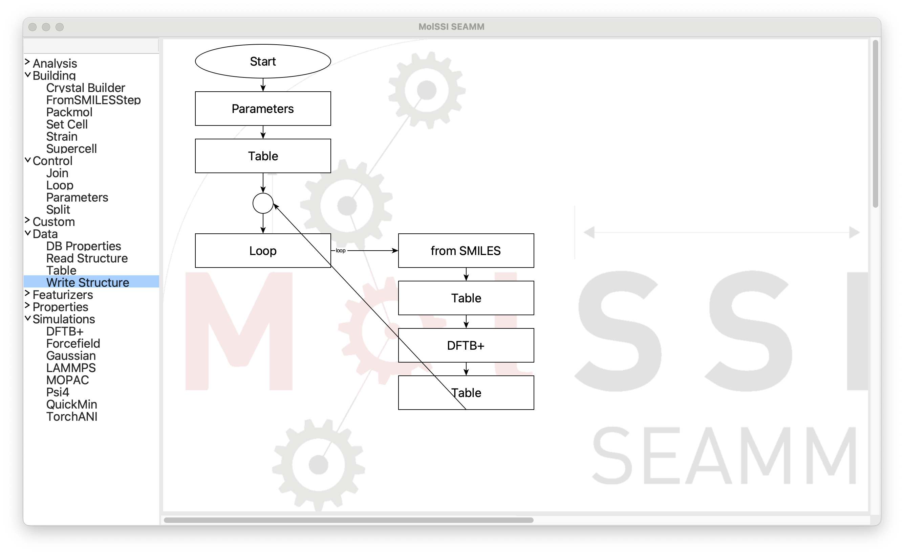
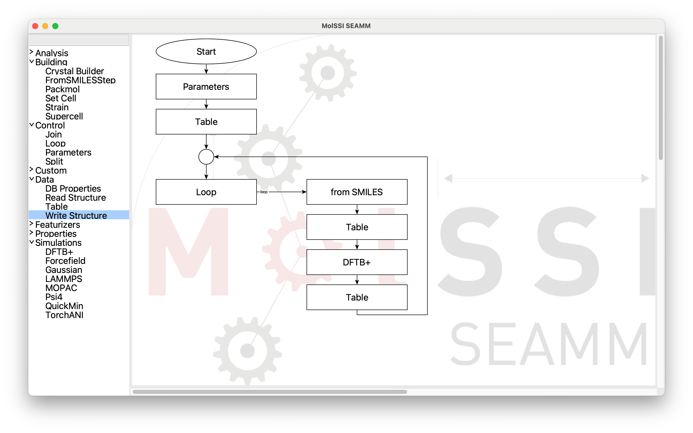
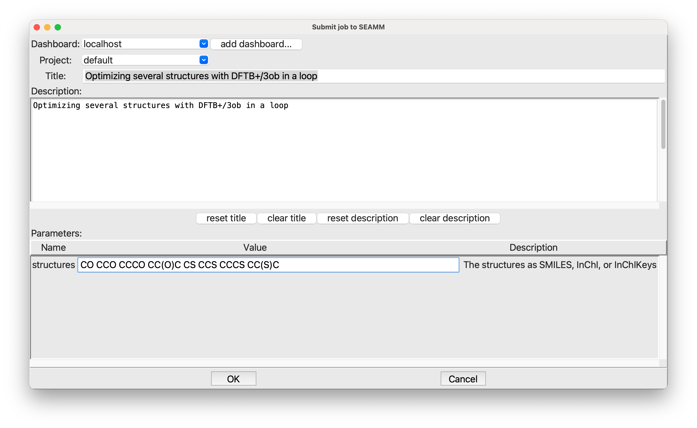
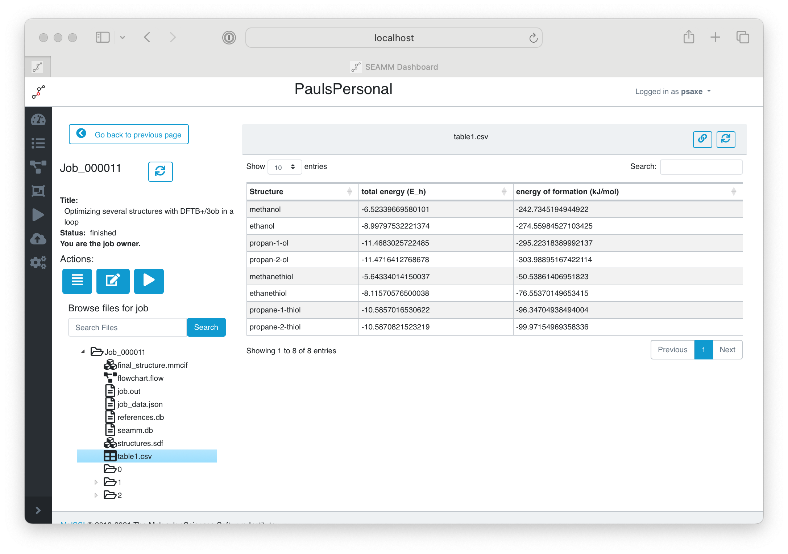
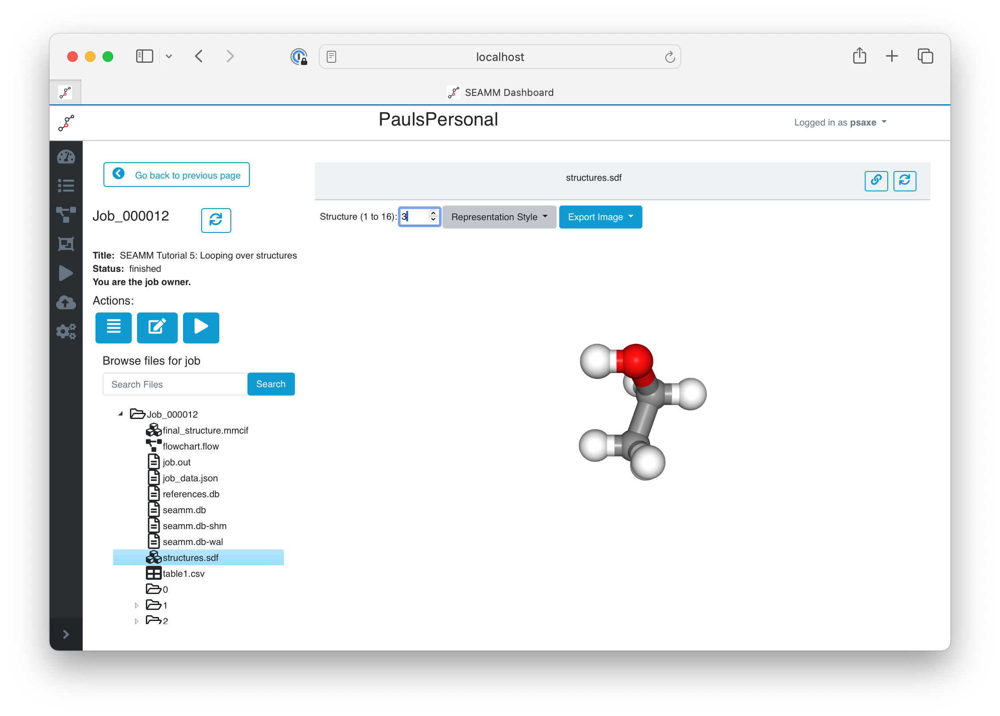

.. _tutorial-5:

**************************
5: Looping Over Structures
**************************

.. Note::
   The flowchart for this tutorial is available at |flowchart_link| and also can be
   directly loaded into SEAMM by opening from Zenodo. The job for this tutorial is
   available on MolSSI's public server, |job_link|.

Introduction
------------
In the previous tutorials we have slowly built up easier and easier ways to run a
calculation on a molecule that we define using SMILES. We've used DFTB+ to run the
calculations because it is available and fast; however, we could replace it with any code
that can optimize structures -- at the moment LAMMPS, MOPAC, Psi4, Gaussian, and
FHI-aims are available in SEAMM, and any of them would work.

Creating the Flowchart
----------------------

The flowchart we want looks like this:

   *The final flowchart*

By now you find it fairly straightforward to make the (empty) flowchart, but there are a
couple steps that are worth mentioning. We'll go into more detail about how to edit the
steps.

You can see on the left of the picture where the steps come from. ``Parameters`` is
under **Control** as are ``Join``, which is the circle, and ``Loop``. ``Table`` is under
**Data**, and ``fromSMILES`` and ``DFTB+`` you already know. When you add the next step
after the ``Loop`` step it will go to the right. So just clieck on the steps on the left
until you get to the second ``Table`` step at the end of the loop:

   *Partly Built Flowchart*

At this point you have to manually connect the last ``Table`` step back to the ``Join``
step. Place the cursor over the last ``Table`` step. Small dots will appear around
it. Move the cursor over the center bottom dot, which will be larger:

   *Selecting the Starting Point for the Connection*

Click on the mouse-button and drag to the circular ``Join`` step, and find the
connection point on the right side:

   *Dragging to the End Point for the Connection*

When the red dot on the ``Join`` step becaomes large, let go of the mouse to drop the
connection onto the step. If the arrow disappears it means that you missed the
connection point. Try again. It should look like this:

   *Successful Connection*

Almost there! It is a bit ugly with the diagonal connection, so clean it up with the
**Edit** menu and select **Clean Layout** or use the accelerator (⌘L on a Mac, ^L on
Windows or Linux):

   *Flowchart after Cleaning Up*

To finish, add the final ``Table`` and ``Write Structure`` steps after the
loop. Cleaning the layout one more time will move them below the loop, if you wish.

Editing the Steps
-----------------
Next we need to edit each of the steps to have it do what we need. This is simple, but a
bit tedious, so the next section will just be a few words and lots of pictures. Fill out
the dialogs as the pictures show.

#. The ``Parameter`` step at the beginning needs to have a mandatory parameters names
   **structures** that is a string with one or more values:

   .. figure:: images/tutorial_5/parameters.png
      :align: center
      :alt: Parameters dialog

      *Editing the Parameters step*

#. For the first ``Table`` step we create a table and add a string column named **Structure**:

   .. figure:: images/tutorial_5/table_1.png
      :align: center
      :alt: Table dialog

      *Editing the first Table step*

#. There is nothing to do for the ``Join`` step so on to the ``Loop`` step. Here we want
   a **Foreach** loop for **structure** in **$structures**:

   .. figure:: images/tutorial_5/loop.png
      :align: center
      :alt: Loop dialog

      *Editing the Loop step*

#. The ``from SMILES`` step is similar to what we did in the third tutorial. Set the
   **Input:** field to **$structure**. This time, however, pay attention to the last
   three items, which tell the code where to put the new structure and what to call
   it. Choose **Create a new system and configuration**, with the system name
   **use IUPAC name** and configuration name **initial**.

   .. figure:: images/tutorial_5/smiles.png
      :align: center
      :alt: Table dialog

      *Editing the from SMILES step*
   
#. For the first ``Table`` step in the loop we want to append a row to the table and put
   the name of the structure (**$_system_db.system.name**) in the **Structure** column
   that we made in the first ``Table`` step:

   .. figure:: images/tutorial_5/table_2.png
      :align: center
      :alt: Table dialog

      *Editing the first Table step in the loop*

   The rather odd string that you used needs a bit of explaining. SEAMM has a few global
   variables that it uses internally that can also be used in the
   flowcharts. **_system_db** is the internal database that sotres all the structures,
   etc. The global variables start with an underscore to keep them separate from your
   variables, so don't create variables starting with an underscore! As before, the
   initial dollar sign (**$**) indicates that this is a reference to a varibale, not a
   simple string. SEAMM is object-oriented, so **$_system_db.system** is always the
   current system, and **$_system_db.system.name** is the name of the system, which we
   just set in the previous step to the IUPAC name of the molecule. So the table will
   have the IUPAC names of the molecules in the structure column.

#. The ``DFTB+`` is again much like it was in the other tutorials. We need a ``Choose
   Parameters`` step. The defaults are fine, so there is no need to edit it. For the
   ``Optimization`` step the setting on the **Parameters** tab are fine. Note that the
   structure will be put in a new configuration. Click on the third tab, **Results**,
   and set it up like this:

   .. figure:: images/tutorial_5/optimization.png
      :align: center
      :alt: Optimization dialog

      *Editing the Optimization step, Results tab*

   The results tab list all the results from the DFTB+ calculation, and allows you to
   save them in various places. You can save them in the database. Or as variables by
   checking the box just to the left of the variable name (which you can edit). We want
   to save the total energy and energy of formation in our table, which is named
   **table1**, so type that into the two entries in the **Save in table** column. The
   last column is used to pick the units, but the defaults of E_h for the total energy
   and kJ/mol for the energy of formation are fine, so there is no need to change them

#. The second ``Table`` step, at the end of the loop. We want to save the table each
   pass through the loop so that we can see the results, and also so that we have them
   if the machine crashes or something else happens. It is not very important for the
   calculations with DFTB+ because they are so fast, but with other, slower methods it
   is a good idea to save often:

   .. figure:: images/tutorial_5/table_3.png
      :align: center
      :alt: Table dialog

      *Editing the last Table step in the loop*

#. That finishes the loop. Now for the ``Table`` step after the loop. All we want to do
   here is print the final table in the output:

   .. figure:: images/tutorial_5/table_4.png
      :align: center
      :alt: Table dialog

      *Editing the last Table step*

#. And the ``Write Structure`` step at the end of the flowchart. We want to write all
   the structures to the file **structures.sdf**:

   .. figure:: images/tutorial_5/write_structure.png
      :align: center
      :alt: Table dialog

      *Editing the Write Structure step*
   
   Note that both **File** and **Structures to write** need to be changed.

Running a Job
-------------

Now to run a job! (File / Run or ⌘R on a Mac, ^R on Windows or Linux):

   *Submitting the job*

As always, you need to put in a title and description of the job. In the **structures**
field, put in a list of structures separated by white space. I used the following::

  CO CCO CCCO CC(O)C CS CCS CCCS CC(S)C

If you don't know SMILES, don't worry! These are quite simple: methanol, ethanol,
1-propanol, and 2-propanol, followed by their sulfur analogs.

Viewing the Results
-------------------
Bring up the Dashboard in your browser and find the job, checking that it has
finished. In the files section of the left panel, click on **table1.csv**:

   *Submitting the job*

You can see the table in the right-hand panel, with the IUPAC names, the total energy in
Hartrees and the energy of formation in kJ/mol. You can right-click on the file in the
left pane and download it to your machine, where it can be opened in Excel or other
spreadsheet program, or read using Python. A CSV file is a common file format tha many
codes can read.

We also printed the table in job.out::

  Step 5: Table  2023.10.30
	Print table 'table1'

	      Structure  total energy (E_h)  energy of formation (kJ/mol)
	       methanol           -6.523397                   -242.734519
		ethanol           -8.997975                   -274.559845
	    propan-1-ol          -11.468303                   -295.223184
	    propan-2-ol          -11.471641                   -303.988952
	   methanethiol           -5.643340                    -50.538614
	    ethanethiol           -8.115706                    -76.553701
	propane-1-thiol          -10.585702                    -96.347049
	propane-2-thiol          -10.587082                    -99.971550

.. Note::
   Most quantum codes calculate a total energy that is the energy of the nuclei
   and electrons, i.e. the energy it would take to separate the nuclei and electron
   infinitely far from each other. The details may differ due to core potentials,
   parameterizations, etc. but that is the gist. It is a large energy,
   which is hidden by using Hartrees, since 1 Hartree = 2625.5 kJ/mol.

   The DFTB+ plug-in has a database of the calculated energy of the elements in their
   standard state -- H2, O2, graphite, ... -- with some of the parameter sets. It uses
   these to calculate the "energy of formation", which is very much like the more normal
   "enthalpy of formation" except that it does not have the translation, rotational, and
   vibrational terms that are in the enthalpy. It is the electronic energy of
   formation. We can calculate the enthalpy, but it is more work; however, the energy of
   formation is a start and easier to understand than the large electronic energies the
   code calculates.

   For comparison, the enthalpies of formation from the NIST Webbook are::

     	      Structure	   enthalpy of formation (kJ/mol)
	       methanol	                     -205.
		ethanol	                     -234.
	    propan-1-ol	                     -256.
	    propan-2-ol	                     -272.3
	   methanethiol	                      -22.8
	    ethanethiol	                      -46.15
	propane-1-thiol	                      -68.58
	propane-2-thiol	                      -76.94

   Remembering that we are comparing energies to enthalpies, and that :term:`DFTB` is a
   fast, approximate method, the results look quite reasonable. The trends are correct
   and energy differences are quite good.

Viewing the Final Structures
----------------------------
The last step of the flowchart wrote all of the structures to the file
**structures.sdf**. You can easily view them in the Dashboard. Click on
**structures.sdf** in the list of files:

   *Viewing the Final Structures in the Dashboard*

Some file formats, such as the :term:`SDF file` we used, support multiple structures in a
file. If there is more than one structure, the Dashboard adds a comment at the top of
the window with the number of structures, plus an entry for selecting them. You can
either type in a structure number (between 1 and 16 in this example) or use the up and
down arrows to move through them. We have 16 structures even though we only ran 8
compounds becasue we stored the initial structure from SMILES as well as the optimized
structure from DFTB+ in separate configurations. If you click through them with the up
arrow you will see pairs of structures, with small changes between the first initial
structure and the second optimized structure in each pair.

If you want to know a bit more, download the structure file and examine the contents::

   SEAMM=methanol/initial
    OpenBabel11102306473D

     6  5  0  0  0  0  0  0  0  0999 V2000
       0.9340   -0.0572   -0.0486 C   0  0  0  0  0  4  0  0  0  0  0  0
       0.4606   -0.3516   -1.3546 O   0  0  0  0  0  0  0  0  0  0  0  0
       0.5773   -0.7986    0.6356 H   0  0  0  0  0  0  0  0  0  0  0  0
       0.5773    0.9059    0.2513 H   0  0  0  0  0  0  0  0  0  0  0  0
       2.0040   -0.0572   -0.0486 H   0  0  0  0  0  0  0  0  0  0  0  0
       0.7940    0.3412   -1.9940 H   0  0  0  0  0  0  0  0  0  0  0  0
     1  2  1  0  0  0  0
     1  3  1  0  0  0  0
     1  4  1  0  0  0  0
     1  5  1  0  0  0  0
     2  6  1  0  0  0  0
   M  RAD  1   1   1
   M  END
   $$$$
   SEAMM=methanol/optimized with DFTB/3ob
    OpenBabel11102306473D

     6  5  0  0  0  0  0  0  0  0999 V2000
       0.9319   -0.0533   -0.0713 C   0  0  0  0  0  4  0  0  0  0  0  0
       0.4617   -0.3478   -1.3615 O   0  0  0  0  0  0  0  0  0  0  0  0
       0.5613   -0.8170    0.6180 H   0  0  0  0  0  0  0  0  0  0  0  0
       0.5780    0.9347    0.2742 H   0  0  0  0  0  0  0  0  0  0  0  0
       2.0360   -0.0497   -0.0324 H   0  0  0  0  0  0  0  0  0  0  0  0
       0.7783    0.3156   -1.9864 H   0  0  0  0  0  0  0  0  0  0  0  0
     1  2  1  0  0  0  0
     1  3  1  0  0  0  0
     1  4  1  0  0  0  0
     1  5  1  0  0  0  0
     2  6  1  0  0  0  0
   M  RAD  1   1   1
   M  END
   >  <Fermi level#DFTB+#DFTB/3ob>
   1.3645835502723223

   >  <energy of formation#DFTB+#DFTB/3ob>
   -2.515766177726602

   >  <total energy per formula unit#DFTB+#DFTB/3ob>
   -177.5106672880487

   >  <total energy#DFTB+#DFTB/3ob>
   -177.5106672880487

   $$$$
   SEAMM=ethanol/initial
   ...

The first line for each structure is the name. SEAMM uses the system and configuration
names: ``SEAMM=methanol/initial`` and ``SEAMM=methanol/optimized with DFTB/3ob`` above.
This is followed by the coordinates and bonds. A nice feature of :term:`SDF files<SDF
file>` is that they can contain property data. SEAMM uses this to add the properties
that were requested in the DFTB+ optimization step to the file, labeling them by the
property name, code (DFTB+), and computational model (DFTB/3ob), separated by **#**::

   >  <total energy#DFTB+#DFTB/3ob>
   -177.5106672880487

These energies are in eV, which is the natural unit for DFTB+.  

Topics Covered
--------------

#. Looping over input data.
#. Capturing key results in tables.
#. A start to understanding the energies produced by DFTB+ and other quantum chemistry
   codes.
#. Viewing a set of structures in an :term:`SDF file`.

.. Shortcut link
.. |flowchart_link| raw:: html

   <a href="https://zenodo.org/doi/10.5281/zenodo.5888991" target="_blank">Zenodo</a>

.. |job_link| raw:: html

   <a href="http://molssi10.molssi.org:55055/#/jobs/314" target="_blank">Job 314</a>
