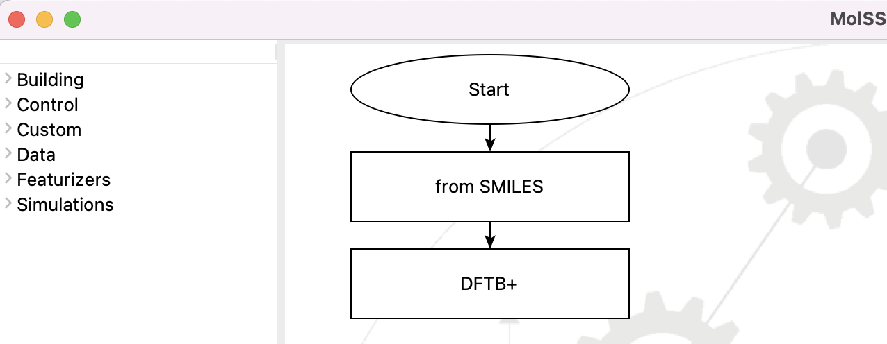
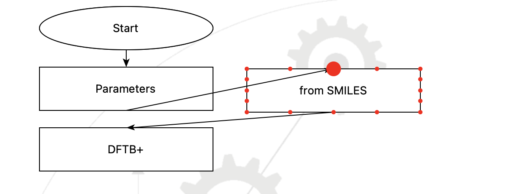

.. _tutorial_4:

*****************************
Running from the Command-Line
*****************************

.. note::
   A `video of this tutorial <https://www.youtube.com/watch?v=Wf9GtKu5rGg>`_ is
   available in the `MolSSI SEAMM channel
   <https://www.youtube.com/channel/UCF_5Kr_AN90CYb0fTgYQHzQ>`_

So far you've seen how to create a flowchart in the SEAMM graphical interface, submit it
to the Dashboard, and examine the results. In this lesson you will learn about running a
flowchart from the command-line, i.e. in a terminal window. Rather than create a
flowchart from scratch, we'll get one from Zenodo and see how to edit it.

.. attention::
   In this tutorial you will
     #. Open a flowchart directly from Zenodo.
     #. Move steps and edit the flowchart.
     #. Learn how to create and use command-line parameters for a flowchart.
     #. Learn how to run from the command-line.

Start the SEAMM GUI either by using the app or running `seamm` in a terminal window in
the conda enviroment `seamm`. Once the GUI appears, use the File / Open menu (or the
short cut key `ctrl-o`) to open a flowchart:

.. figure:: images4/4_open_file_menu.png
   :width: 500px
   :align: center
   :alt: The file menu

   The file menu.

The dialog will look like this:

.. figure:: images4/4_open_dialog.png
   :width: 500px
   :align: center
   :alt: The Open dialog

   The Open dialog.

You probably won't have many flowcharts yet, but we aren't going to open one from the
local machine. Instead, we are going to get one stored at Zenodo. You can see it in your
web browser in the `SEAMM Flowcharts community`_ if you wish, but
you can easily get it from SEAMM itself. In the first line of the dialog change it from
`Open flowchart from local files` to `Open flowchart from Zenodo`. The dialog will
change a bit. Click on the `+` button to add a filter in the criterion and type
"Tutorial" into the last field in the line that appears. Click `Search`. If you click on
the first entry, `SEAMM Tutorial 1` the dialog will look like this:

.. figure:: images4/4_open_zenodo.png
   :width: 500px
   :align: center
   :alt: Open from Zenodo

   Opening a flowchart from Zenodo.

Before clicking `OK` to open the flowchart, notice that there is a small arrow next to
`SEAMM Tutorial 1` in the list of tutorials. If you click on it it will reveal the
available versions of the tutorial:

.. figure:: images4/4_zenodo_versions.png
   :width: 500px
   :align: center
   :alt: Versions of a flowchart

   Selecting a specific version of a flowchart.

You can select any version to open, so you can access the entire history of a flowchart,
and run older versions if you need to. Usually, however, you want the latest version --
you do here -- so select the most recent version and click `Open`:

   *The flowchart for Tutorial 1, read from Zenodo*

At this point you could run the flowchart as you did in the first tutorial and get
exactly the same results for the ethane thiol molecule. This is nice from the point of
view of reproducibility, but not very useful for doing your science. In the next steps
you'll edit the flowchart to accept an input string for the SMILES and then run ethanol
from the command-line.

Make some room for another step immediately after the `Start` step by clicking on the
**from SMILES** step and dragging it to the right:

.. figure:: images4/4_edit_1.png
   :width: 500px
   :align: center
   :alt: Moving a step of the flowchart

   Moving a step by dragging it.

Now right-click on the arrow connecting the `Start` step and the `from Smiles` step that
you just moved, and select `Delete`:

.. figure:: images4/4_edit_2.png
   :width: 500px
   :align: center
   :alt: Deleting a connection

   Deleting the connection between two steps.

Open the `Control` section of the left menubar and add a **Parameters** step:

.. figure:: images4/4_edit_3.png
   :width: 500px
   :align: center
   :alt: Adding the **Parameters** step

   Adding the **Parameters** step.

Now you need to connect the flowchart back together, with the new **Parameters** step as
the first step. Place the cursor over the **Parameters** step. Red dots will appear round
the edge. Move the cursor over the center bottom dot and it will become larger,
indicating that the mouse is over it. Click and drag the arrow that appears to the
center top dot of the `from Smiles` step, and when that dot becomes large, release the
mouse button:

   Connecting the **Parameters** step to the **from Smiles** step.

Your flowchart should now look like this:

.. figure:: images4/4_edit_5.png
   :width: 500px
   :align: center
   :alt: Edited flowchart

   The edited flowchart.

It will work, but it doesn't look very nice. You could clean it up by dragging the steps
around, but SEAMM will do it automatically. Under the `Edit` menu select the `Clean
layout` command, or use the shortcut `ctrl-L` to snap the steps into place:

.. figure:: images4/4_edit_6.png
   :width: 500px
   :align: center
   :alt: Clean flowchart

   Clean flowchart.

Almost done! You need to set the **Parameters** step. Edit it by double-clicking or using
right-click and `Edit`. Click on the `+` button to add another parameter and set it up
as shown:

.. figure:: images4/4_edit_7.png
   :width: 500px
   :align: center
   :alt: Setting the **Parameters** step

   Setup of the **Parameters** step.

The name of the variable will be `SMILES`, and it expects a single string value. It is
required -- not optional -- meaning that it must be supplied on the command-line, e.g.::

  flowchart.flow CCO

where `CCO` is the SMILES representation of the molecule. If you left it as an optional
character it would need to be prefixed by `--SMILES`::

  flowchart.flow --SMILES CCO

and would not be required. This is fine for optional parameters that have reasonable
defaults, but not appropriate for the molecule we want to run, since there is no
default.

Next you need to make a small modification in the **from SMILES** step. Close out the
**Parameters** step by clicking `OK` twice, then edit the **from SMILES** step:

.. figure:: images4/4_edit_8.png
   :width: 500px
   :align: center
   :alt: Editing the **from SMILES** step

   Editing the **from SMILES** step.

Rather than typing the SMILES for the molecule directly into the entry filed, as you did
in the first tutorial, change it to `$SMILES`. Remember that you called the variable
`SMILES` in the **Parameters** step. The dollar sign (`$`) in front lets SEAMM know that
this is a variable, and to use its value. Close the dialog by clicking `OK`.

Save the flowchart (`File` menu, `Save` or `ctrl-S`) to a folder that you can
rememeber. I put my copy in `~/SEAMM/flowcharts`, which you will see in the next
steps. But anywhere is fine.

Now switch to a terminal window and type the following::

  (base) psaxe@paul run2 % conda activate seamm
  conda activate seamm
  (seamm) psaxe@paul run2 % ~/SEAMM/flowcharts/tutorial-4.flow --help
  ~/SEAMM/flowcharts/tutorial-4.flow --help
  usage: /Users/psaxe/SEAMM/flowcharts/tutorial-4.flow [-h] [--root ROOT] [--datastore DATASTORE] [--job-id-file JOB_ID_FILE]
                                                       [--dashboards DASHBOARDS]
                                                       [--log-level {NOTSET,DEBUG,INFO,WARNING,ERROR,CRITICAL}]
                                                       [--database DATABASE] [--read-only] [--standalone] [--project PROJECTS]
                                                       [--title TITLE] [--force] [--parallelism {none,mpi,openmp,any}]
                                                       [--ncores NCORES] [--memory MEMORY]
                                                       SMILES start-node-step control-parameters-step from-smiles-step
                                                       dftbplus-step

  positional arguments:
    SMILES                The SMILES for the molecule

  optional arguments:
    -h, --help            show this help message and exit

  main options:
    The main options for SEAMM

    --root ROOT           The root directory for SEAMM data, default: ~/SEAMM
    --datastore DATASTORE
                          The datastore (directory) for this run, default: ${root}/Jobs
  ...

You need to make sure that you are running in the `SEAMM` conda environment. I wasn't --
notice the `(base)` flag in the prompt -- so I activated the environment. Then run the
flowchart with the `--help` flag. Your path may be different than mine!

The output is quite a bit longer than shown, but is self-explanatory. The first line
gives a summary of the command and all options. Note that the `SMILES` parameter is not
optional, and that the help for it is whatever you typed in the **Parameters**
dialog. This is how you can help others use your flowchart.

Next run the flowchart::

  (seamm) psaxe@paul run2 % ~/SEAMM/flowcharts/tutorial-4.flow --standalone CCO
  ~/SEAMM/flowcharts/tutorial-4.flow --standalone CCO
  Running in standalone mode.
  Running in directory '/Users/psaxe/tmp/run2'

  Description of the flowchart
  ----------------------------
  Step 0: Start  2022.1.17

  Step 1: Parameters  2021.10.13
      The following variables will be set from command-line arguments, or if
      not present, to the default value.

      +------------+--------+-----------+-----------------------------+
      | Variable   | Type   | Default   | Description                 |
      +============+========+===========+=============================+
      | SMILES     | str    |           | The SMILES for the molecule |
      +------------+--------+-----------+-----------------------------+

  Step 2: from SMILES  2021.10.13
      Create the structure from the SMILES in the variable '$SMILES', overwriting
      the current configuration. The name of the system will be the canonical
      SMILES of the structure. The name of the configuration will be initial.

  Step 3: DFTB+  2022.1.18

     Step 3.1: Choose Parameters
	 Using the '3ob' set of Slater-Koster parameters.

     Step 3.2: Optimization
	 Structural optimization using the Rational Function method with a
	 convergence criterion of 0.0 hartree/bohr. A maximum of 200 will be used.

  Running the flowchart
  ---------------------
  Step 0: Start  2022.1.17

  Step 1: Parameters  2021.10.13
      The following variables have been set from command-line arguments,
      environment variables, a configuration file, (.ini), or a default value, in
      that order.

      +------------+---------+-------------+-----------------------------+
      | Variable   | Value   | Set From    | Description                 |
      +============+=========+=============+=============================+
      | SMILES     | CCO     | commandline | The SMILES for the molecule |
      +------------+---------+-------------+-----------------------------+

  Step 2: from SMILES  2021.10.13
      Create the structure from the SMILES 'CCO', overwriting the current
      configuration. The name of the system will be the canonical SMILES of the
      structure. The name of the configuration will be initial.

      Created a molecular structure with 9 atoms.
	     System name = CCO
      Configuration name = initial

  Step 3: DFTB+  2022.1.18

      Step 3.1: Choose Parameters
	  Using the '3ob' set of Slater-Koster parameters.

      Step 3.2: Optimization
	  Structural optimization using the Rational Function method with a
	  convergence criterion of 0.0001 E_h/a_0. A maximum of 200 will be used.

	  The geometry optimization converged in 25 steps to a total energy of
	  -8.997975 Ha. The calculated formation energy is -274.56 kJ/mol.

  Wrote the final structure to 'final_structure.mmcif' for viewing.

  Primary references:

  (1) Jessica Nash and Eliseo Marin-Rimoldi and Paul Saxe. SEAMM: Simulation
      Environment for Atomistic and Molecular Modeling, version 2022.1.17; The
      Molecular Sciences Software Institute (MolSSI): Virginia Tech, Blacksburg,
      VA, USA, https://doi.org/10.5281/zenodo.5153984, DOI: 10.5281/zenodo.5153984

  (2) O'Boyle, Noel M. and Banck, Michael and James, Craig A. and Morley, Chris
      and Vandermeersch, Tim and Hutchison, Geoffrey R. Open Babel: An open
      chemical toolbox. Journal of Cheminformatics 2011, 3, 33. DOI:
      10.1186/1758-2946-3-33

  (3)  The Open Babel Package, version 3.1.0; Open Babel, http://openbabel.org

  (4) Hourahine, B.; Aradi, B.; Blum, V.; Bonafé, F.; Buccheri, A.; Camacho, C.;
      Cevallos, C.; Deshaye, M. Y.; Dumitrică, T.; Dominguez, A.; Ehlert, S.;
      Elstner, M.; van der Heide, T.; Hermann, J.; Irle, S.; Kranz, J. J.; Köhler,
      C.; Kowalczyk, T.; Kubař, T.; Lee, I. S.; Lutsker, V.; Maurer, R. J.; Min,
      S. K.; Mitchell, I.; Negre, C.; Niehaus, T. A.; Niklasson, A. M. N.; Page,
      A. J.; Pecchia, A.; Penazzi, G.; Persson, M. P.; Řezáč, J.; Sánchez, C. G.;
      Sternberg, M.; Stöhr, M.; Stuckenberg, F.; Tkatchenko, A.; Yu, V. W.-z.;
      Frauenheim, T. DFTB+, a software package for efficient approximate density
      functional theory based atomistic simulations. The Journal of Chemical
      Physics 2020, 152, 124101. DOI: 10.1063/1.5143190

  (5) Gaus, Michael; Goez, Albrecht; Elstner, Marcus. Parametrization and
      Benchmark of DFTB3 for Organic Molecules. Journal of Chemical Theory and
      Computation 2013, 9, 338-354. DOI: 10.1021/ct300849w

  Secondary references:

  (1) Paul Saxe. Control Parameters plug-in for SEAMM, version 2021.10.13; The
      Molecular Sciences Software Institute (MolSSI): Virginia Tech, Blacksburg,
      VA, USA, https://github.com/molssi-seamm/control_parameters_step

  (2) Paul Saxe. From Smiles plug-in for SEAMM for creating structures from
      SMILES, version 2021.10.13; The Molecular Sciences Software Institute
      (MolSSI): Virginia Tech, Blacksburg, VA, USA, https://github.com/molssi-
      seamm/from_smiles_step, DOI: 10.5281/zenodo.5159800

  (3) Paul Saxe. DFTB+ plug-in for SEAMM, version 2022.1.18; The Molecular
      Sciences Software Institute (MolSSI): Virginia Tech, Blacksburg, VA, USA,
      https://github.com/molssi-seamm/dftbplus_step

  Process time: 0:00:00.843663 (0.844 s)
  Elapsed time: 0:00:01.867495 (1.867 s)
  (seamm) psaxe@paul run2 %

The `--standalone` flag tells SEAMM to run the flowchart in the current directory
and not add it to the datastore. I tend to do this when trying new flowcharts and
calculations so that I don't fill the datastore with junk. My calculations tend not to
work the first time or two!

You should be familiar with the output by now, but notice two parts. In the first part,
where it tells you what it is going to do::

    Step 1: Parameters  2021.10.13
	The following variables will be set from command-line arguments, or if
	not present, to the default value.

	+------------+--------+-----------+-----------------------------+
	| Variable   | Type   | Default   | Description                 |
	+============+========+===========+=============================+
	| SMILES     | str    |           | The SMILES for the molecule |
	+------------+--------+-----------+-----------------------------+

    Step 2: from SMILES  2021.10.13
	Create the structure from the SMILES in the variable '$SMILES', overwriting
	the current configuration. The name of the system will be the canonical
	SMILES of the structure. The name of the configuration will be initial.

it describes the parameters, in this case just the single `SMILES` variable you
added. And in the **from SMILES** step it notes that it will build the structure using
whatever the value of the `SMILES` variable is.

Later in the output, when it is running the job, the output is more explicit::

    Step 1: Parameters  2021.10.13
	The following variables have been set from command-line arguments,
	environment variables, a configuration file, (.ini), or a default value, in
	that order.

	+------------+---------+-------------+-----------------------------+
	| Variable   | Value   | Set From    | Description                 |
	+============+=========+=============+=============================+
	| SMILES     | CCO     | commandline | The SMILES for the molecule |
	+------------+---------+-------------+-----------------------------+

    Step 2: from SMILES  2021.10.13
	Create the structure from the SMILES 'CCO', overwriting the current
	configuration. The name of the system will be the canonical SMILES of the
	structure. The name of the configuration will be initial.

	Created a molecular structure with 9 atoms.
	       System name = CCO
	Configuration name = initial

It gives the value of the `SMILES` variable and where it was set -- command-line in this
case. Some optional parameters can be set in the `seamm.ini` configuration file if you
want to use them all of the time. And in the **from SMILES** step it now prints the
actual SMILES being used to construct the molecule.

This is the end of this tutorial.

.. _seamm flowcharts community: https://zenodo.org/communities/seamm-flowcharts/?page=1&size=20
