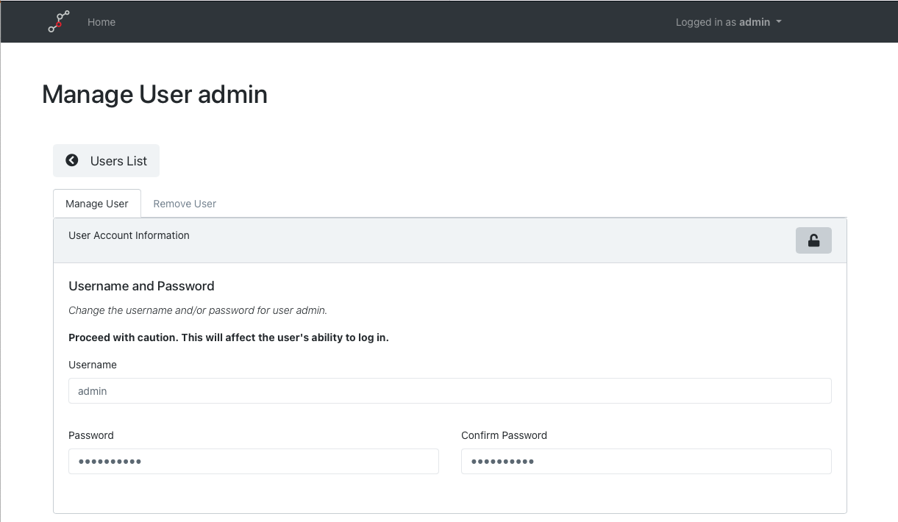
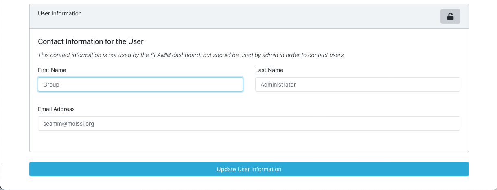

.. _dashboard-management:

**********************
Managing the Dashboard
**********************

As noted in the overview, the Dashboard supports users, groups and permissions. If you
are the only person using the Dashboard -- for example if you are using it on your
laptop -- you don't need to worry about this section beyond changing the default
passwords. However, if you have a group using the same dashboard you will at least need
to add them as users. If you desire you can also put them in groups to streamline
sharing results between group members.

Initial Setup
-------------
.. note::
   A `video of setting the initial passwords
   <https://www.youtube.com/watch?v=LjnHJg_DMC8>`_ is available in the `MolSSI SEAMM
   channel <https://www.youtube.com/channel/UCF_5Kr_AN90CYb0fTgYQHzQ>`_

When the Dashboard is installed two user accounts are made automatically: an **admin**
acount and one for you, based on your username on the machine. Both have administrative
privileges so you can user either for the initial setup, but since you may not know the
user name chosen for you, it is easiest to start with the **admin** account. The initial
password is also **admin**, so login as the admin user. Make sure that the Dashboard is
running (see the Installation instructions for how to run the Dashboard), and open the
main page of the Dashboard in your browser (|dashboard_link|, opens in another tab):

.. figure:: ../../images/dashboard/login.png
   :align: center
   :width: 80%
   :alt: The Public User pulldown in the Dashboard

   The **Public** user pulldown at top-right of the Dashboard.

Click on **Log in** and user the username **admin** and password **admin**. This should
take you to a slightly different Dashboard page:

.. figure:: ../../images/dashboard/admin_login.png
   :align: center
   :width: 80%
   :alt: The **admin** User pulldown in the Dashboard

   The **admin** user pulldown at top-right of the Dashboard.

Click on the **Manage Users** menu item to get to the page for managing users:

.. figure:: ../../images/dashboard/manage_users.png
   :align: center
   :width: 80%
   :alt: The Manage Users page

   The Manage Users page.

User #1 is always **admin** and user #2 should be you. Click on the **Manage User**
button for the **admin** user:

.. figure:: ../../images/dashboard/change_password.png
   :align: center
   :width: 80%
   :alt: The change password section of manage user.

   Changing the user's password.

Click on the lock symbol at the top-right of the section to allow changes, and end enter
the new password twice:

   Changing the password.

The Dashboard won't let you leave the contact information for the user, even the
**admin** user, blank so scroll to the bottom of the page, click the lock to make
changes, and enter a name and email address for the **admin** account:

   The contact information for a user.

And finally click **Update User Information** to accept the changes.

You should also change the password for your user account.

Adding and Removing Users
-------------------------
Both of these operations are straightforward. To add a user, use the **Create New User**
button at the top right of the **Manage Dashboard Users** page:

.. figure:: ../../images/dashboard/add_user_button.png
   :align: center
   :width: 80%
   :alt: Button for adding users

   Adding users

To remove a user, use the **Remove User** tab when managing the user:

.. figure:: ../../images/dashboard/remove_user_button.png
   :align: center
   :width: 80%
   :alt: Button for removing a user

   Removing a user

.. |dashboard_link| raw:: html

   <a href="http://127.0.0.1:5000" target="_blank">127.0.0.1:5000</a>

